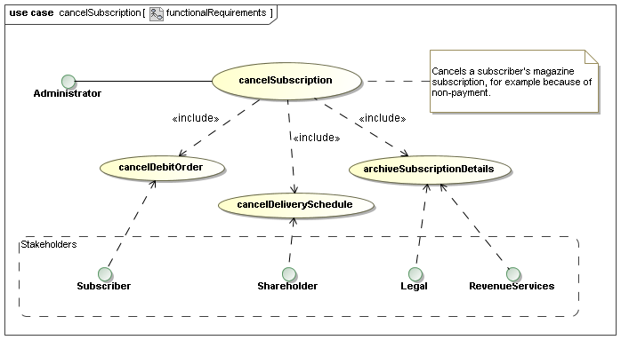
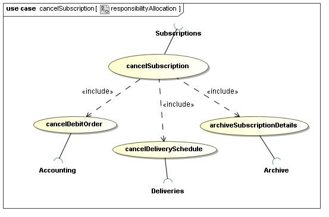
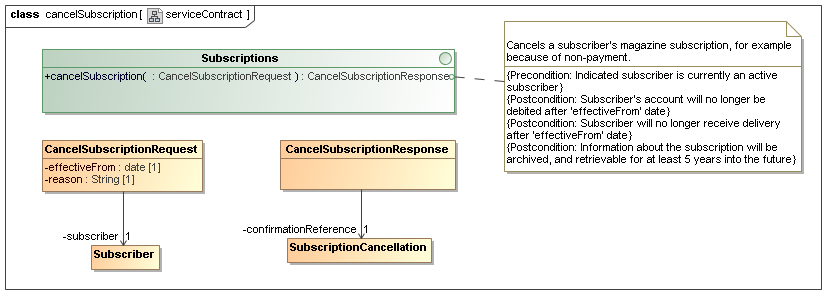
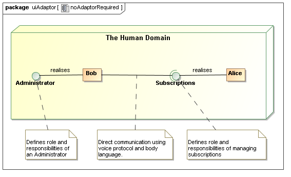
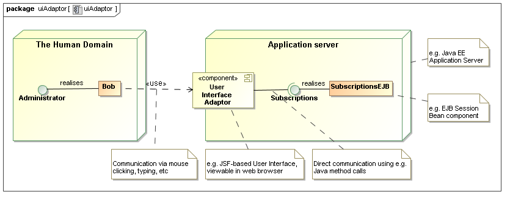
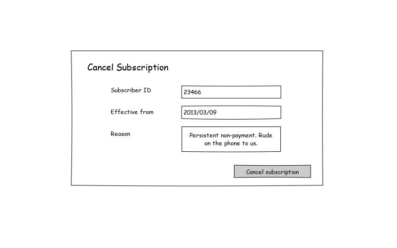
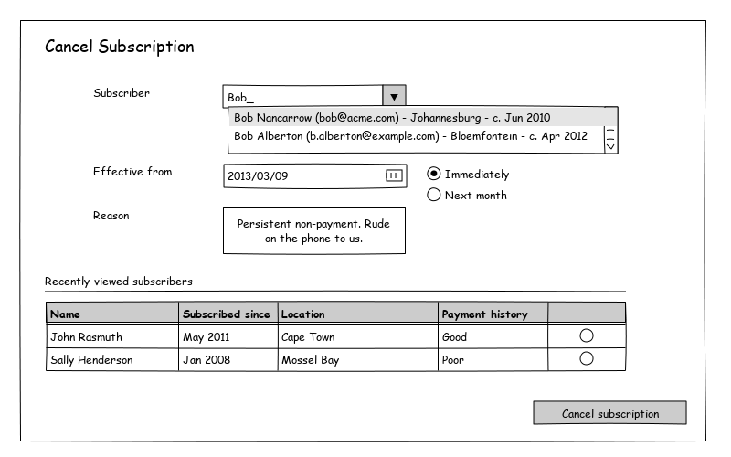
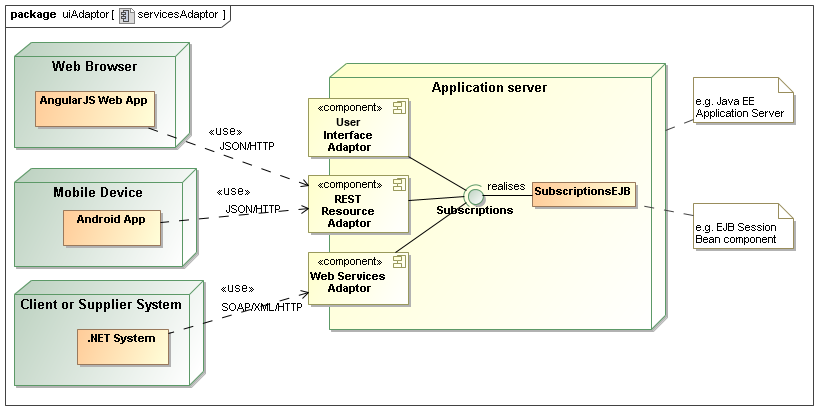

% Handling User Interface requirements in the context of Model-Driven Development
% Dawid Loubser (dawid@jini.guru)
% August 11, 2014

The requirements for a new system are frequently expressed as one technology-specific
document ("Business Requirements Specification"), describing, for example, the development
of a web-based portal or mobile device app.

When we follow a model-driven development process, the requirements for such a project
are ultimately interpreted in two independent "layers":

1. *Functional requirements*, which make no reference to any technology whatsoever. A
   technology-neutral analysis and design methodology like URDAD is followed, producing
   a PIM (Platform-Independent Model) that satisfies the requirements. 
   Omitting technology from this process makes 
    * it easy to reason about the core requirements, 
    * increases the likelihood for business process innovation, and 
    * builds a business asset that survives any technology changes.
2. *Quality requirements* that are orthogonal to the functional requirements. These include
   usability, auditability, maintainability, scalability, performance, accessibility, and so on.
   These qualities are not (and should not be) provided by the PIM. Instead, they are provided
   by the infrastructure within which the processes are deployed. For software systems, this may 
   include the technologies that the processes are mapped to, and the container within which they are 
   deployed. Aspects of the infrastructure may be provided "off the shelf", or built for the
   project in question.

In the context of a provided Business Requirements Specification, this process may at first seem to
introduce unnecessary complexity into the process - after all, "why don't you *just build it* ?"

Experience has, however, shown that this separation - which is a key aspect of *model-driven development*

* fundamentally simplifies the process,
* limits project risk all around, and
* allows for a high degree of concurrency (simultaneous design or construction) from early
  on in the process.

Where does the User Interface fit into all of this?
---------------------------------------------------

While the user interface is arguably the most important aspect for most users of a system -
and hence enjoys a great deal of emphasis in business requirements documentation - it may
seem counter-intuitive that no mention of the user interface is made in the PIM, or in
the functional requirements.

When we perform technology-neutral analysis and design, it the entire system could
functionally be realised by almost any technology - albeit with different *qualities*. 
During this phase, it helps to imagine that we are living a couple of hundred years in the past, 
with nothing but people, and paper-based forms.

    Where is the user interface now?

If Victorian-era systems aren't your thing, imagine deploying your system a couple of
hundred years into the *future* - where every component could be realised by a software component
entirely, leaving us humans to get on doing things that we enjoy doing. When we do need to interact
with the system, we may be able to directly communicate with it by thought.

    Again, where is the user interface now?

When we design business processes independent of technology, *we mean it*. The User Interface is simply
an adaptor between a human and a software component. Furthermore, we often need different adaptors
depending on the direction of the service request, for example:

* A web-based interface, when a person requests a service from a software component, and
* Dispatching an e-mail to a person, when a software component requests a service from a person.

Example: Cancelling a subscription
----------------------------------

Consider a service offered by a component in a magazine distribution company to
cancel a subscriber's subscription. The stakeholders have the following functional
requirements:

 \

After completing an URDAD analysis and design cycle (detail not shown here), the result might
be the following responsibility allocation:

 \

And finally the following service contract:

 \

If both the *Administrator* and the *Subscriptions* roles are played by human beings, no adaptor would be 
required between them. All that would be required is for a message path to be established (either by making 
a telephone call, or by walking to the appropriate desk) and requesting the service by voice:

    "Hi. Please cancel the subscrition for John Deere - subscription 
     number 46234 - effective next month. This is because of non-payment."

 \

The Administrator is verbally constructing and submitting a *CancelSubscriptionRequest*.

If the *Administrator* is a human being, and is interacting with a software implementation of 
*Subscriptions*, an *adaptor* is required. Typical application server environments allow us
to host that adaptor together with the software system:

 \

The role played by this adaptor is still simply to let the user construct and submit a *CancelSubscriptionRequest*,
albeit with certain qualities:

* Efficiency: How much energy must the user expend to request the service?
* Usability: How easy is it for a user with minimal or no training to request the service?
* Security: How do we establish the identity of the user requesting the service?

User Interface Features as determined by quality requirements
-------------------------------------------------------------

Quality requirements such as *usability* dictate the use of certain strategies, and these
dramatically impact the details of the user interface.

In the case of canceling a subscription, the Administrator has to provide a *reference* (UML Association)
to the subscriber in question. This implies an object reference, or a shared identifier, that the
administrator needs to provide to the Subscriptions service.

A user interface with *low usability* might leave the responsibility of identifying the
subscriber, or entering the date correctly, entirely in the hands of the user:

 \

A user interface with *high usability* might make it much easier for the administrator to
pick the subsciber whose subscription to cancel, employing multiple strategies: Name-based,
as-you-type searching, and recalling recently-used information:

 \

The user interface with greater usability introduces the need for several finer-grained services.
These are often not in the scope of a technology-neutral functional requirements, and are introduced
only to support certain quality requirements of technology adaptors, like user interfaces. There
are at least three such use-cases here:

* Find subscriber by name
* Find recently-viewed subscribers (a service that is only possible for the user-interface to provide!), and
* Viewing, and probably maintainance of, the payment history of a subscriber

The same holds true for various pieces of infrastructure that make other qualities available, for
example: having to "log in" before using the user interface, to support auditability and access control.

Adators to other technologies
-----------------------------

Of course, *accessibility* (through various channels) is a common quality requirement, and typical application deployment environments (such as Java EE) provide the ability to host various other
adaptors - either to facilitate different user interface technology, or for systems integration:

 \

When we treat our user interface as simply an adaptor, we are usually ready for any other kind
of adaptor to be rapidly applied, since the core service was designed without user interface
(or any other technology-specific) concerns.

Summary
-------

A *Use-case* is defined as a "service of value". This is often translated into "a reason for using the system".
Logging in, or viewing a list of recently-accessed records, are not a "reason to use a system" - 
*they only support certain quality requirements of other use-cases*.

If we don't separate the core technology-neutral analysis and design from the quality requirements of a particular adaptor like a user interface, the business analysis process can quickly become bogged-down in technology-specific complexity. Furthermore, business analysts can no longer fully model the business problem - it requires the involvement of technical specialists.

Only once the core business processes are analysed and designed, the requirements of technology-specific adaptors
- such as user interfaces - are analysed (we can't ignore them, after all!). This is now a much simpler, well-defined
task, usually resulting in greater quality, consistency, and re-use.

Separate design and technical implementation teams can, from an early stage of the project, start addressing both the functional and non-functional requirements concurrently, in the spirit of Model-Driven Development.
